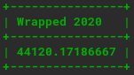
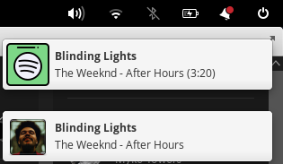
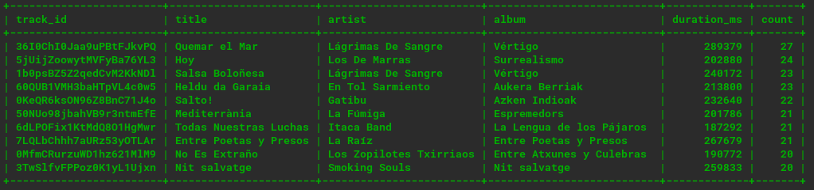

    <h1>100tipy</h1>
    
    
Spotify Wrapped whenever you want! 🎶

    

---

## Requirements
You have to create a new user and a new database in MySQL.

Also, you have to register the app in [Spotify for Developers](https://developer.spotify.com/dashboard) and get your client ID and secret. You can follow [this tutorial](https://developer.spotify.com/documentation/general/guides/app-settings/) for that.

When you have done all of that, replace the values in the [.env](.env) file.

**NOTE:** You have to activate the desktop notifications in Spotify app to work.

## Examples
- Notification:

    

- List of songs: 
  
    

## TODO:
- [ ] Improve this README
- [ ] Work without the notifications on
- [ ] Make Windows/Mac version
- [ ] Create mobile app
- [ ] Sync data between devices

